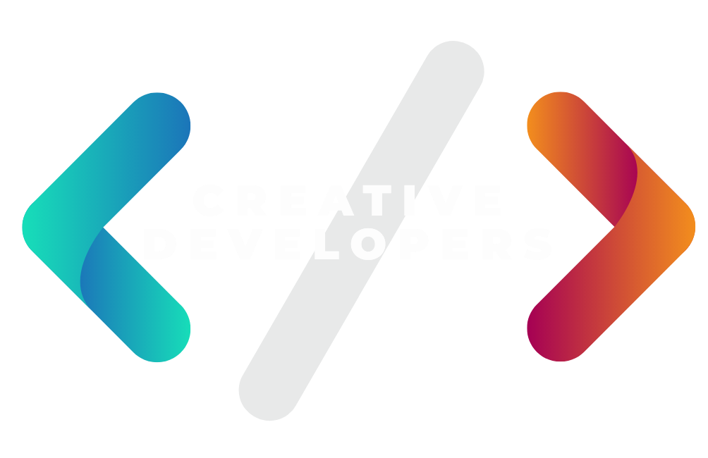

<p align="center">
  
</p>

# TesloShop API

## Description

[Nest](https://github.com/nestjs/nest) framework TypeScript starter repository.

## Clone repository

```bash
git clone https://
```

## Installation

```bash
yarn install
```

## Configure enviroment

### Create file ```.env``` and add credentials

```bash
#=========================================
# APP CONFIG
#=========================================
APP_ID=nestjs-tesloshop
API_PREFIX=/api/v1
NODE_ENV=dev
LOG_LEVEL=debug

#=========================================
# SERVER PORT
#=========================================
PORT=3000

#=========================================
# DB CONNECTION
#=========================================
DB_HOST=some_host
DB_NAME=some_db_name
DB_USER=soome_user
DB_PASSWORD=some_password
DB_PORT=5432
```

## Running DB

```bash
docker-compose up -d
```

## Running the app

```bash
# development
yarn run start

# watch mode
yarn run start:dev

# production mode
yarn run start:prod
```

## Test

```bash
# unit tests
yarn run test

# e2e tests
yarn run test:e2e

# test coverage
yarn run test:cov
```

## Support

MTO Team support.
